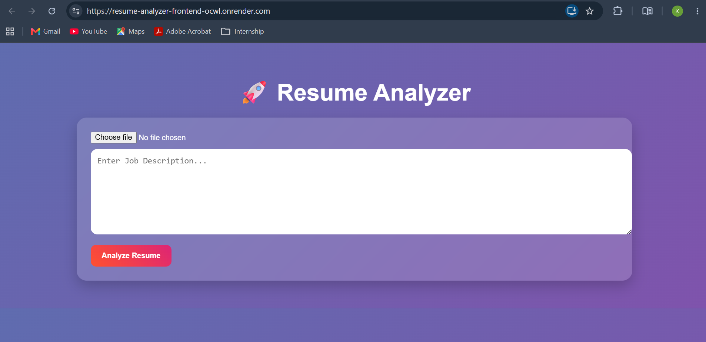
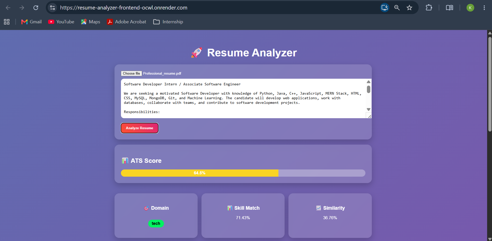

# Resume Analyzer 🚀

An intelligent ATS-friendly Resume Analyzer that evaluates a resume against a job description and provides detailed insights including ATS score, skill matching, missing skills, improvement suggestions, and job recommendations.


---

## ✨ Features

* ATS Score Calculation (0–100%)
* Resume and Job Description Matching
* Skill Match Analysis
* Missing Skills Detection
* Domain Identification
* Resume Improvement Suggestions
* Job Recommendations
* PDF Resume Upload Support
* Clean and Responsive User Interface

---

## 🛠 Tech Stack

### Frontend

* React.js
* Axios
* CSS

### Backend

* Flask
* Flask-CORS
* pdfplumber
* NLTK
* Scikit-Learn

### Deployment

* Render (Frontend)
* Render (Backend)

---

## 📂 Project Structure

```text
resume-analyzer/
│
├── backend/
│   ├── app.py
│   ├── utils.py
│   ├── requirements.txt
│   ├── Procfile
│   └── runtime.txt
│
├── frontend/
│   ├── public/
│   ├── src/
│   │   ├── App.js
│   │   ├── App.css
│   │   └── ...
│   ├── package.json
│   └── package-lock.json
│
└── README.md
```

---

## 🚀 Local Setup

### 1. Clone Repository

```bash
git clone https://github.com/kamala-github04/resume-analyzer.git
cd resume-analyzer
```

### 2. Backend Setup

```bash
cd backend

python -m venv venv

# Windows
venv\Scripts\activate

pip install -r requirements.txt

python app.py
```

Backend runs at:

```text
http://localhost:8080
```

---

### 3. Frontend Setup

Open a new terminal:

```bash
cd frontend

npm install

npm start
```

Frontend runs at:

```text
http://localhost:3000
```

---

## 🌐 Live Demo

### Frontend

[Add your Render Frontend URL here](https://resume-analyzer-frontend-ocwl.onrender.com)

### Backend

[Add your Render Backend URL here](https://resume-analyzer-1-kxxu.onrender.com)

---

## 📝 How to Use

1. Upload a PDF Resume.
2. Paste the Job Description.
3. Click **Analyze Resume**.
4. View:

   * ATS Score
   * Skill Match Score
   * Similarity Score
   * Missing Skills
   * Suggestions
   * Recommended Job Roles

---

## 📊 Analysis Output

The system provides:

* ATS Compatibility Score
* Skill Match Percentage
* Resume Similarity Score
* Missing Skills List
* Personalized Suggestions
* Recommended Job Roles
* Extracted Resume Skills
* Resume Domain Identification

---

## 📸 Screenshots

### Home Page



### Analysis Results



---

## 🚀 Deploy on Render

### Backend Deployment

1. Create a new Web Service on Render.
2. Connect your GitHub repository.
3. Configure:

```text
Root Directory: backend
Build Command: pip install -r requirements.txt
Start Command: gunicorn app:app
```

4. Deploy the service.

---

### Frontend Deployment

1. Create another Web Service on Render.
2. Configure:

```text
Root Directory: frontend
Build Command: npm install && npm run build
Start Command: npx serve -s build
```

3. Add Environment Variable:

```text
REACT_APP_API_URL=<your-backend-url>
```

4. Deploy the service.

---

## 🔮 Future Enhancements

* DOCX Resume Support
* AI-Powered Resume Suggestions
* Resume Builder
* PDF Report Generation
* User Authentication
* Resume History Tracking
* Dashboard Analytics

---

## 👨‍💻 Author

**Kamala V**

B.Tech Information Technology

GitHub: https://github.com/kamala-github04

---

